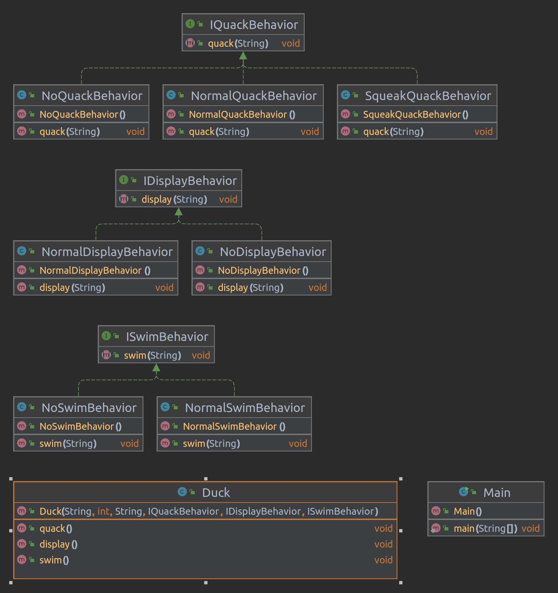

# Strategy Design Pattern

The Strategy design pattern is a behavioral design pattern that allows you to define a family of interchangeable algorithms, encapsulate each one as a separate class, and make them interchangeable at runtime. It enables you to select an algorithm or strategy dynamically based on the specific context or requirements.

## Overview

- Design patterns are reusable solutions to common problems that arise during software design and development.
- Design patterns provide proven approaches and best practices for designing software systems that are flexible, maintainable, and scalable.
- Design patterns serve as templates or blueprints for solving specific design or architectural challenges in a consistent and efficient manner.
- Design patterns can be categorized into three main types: creational, structural, and behavioral patterns.
- Creational patterns deal with object creation mechanisms, structural patterns focus on object composition and relationships, and behavioral patterns address communication and interaction between objects.

## Benefits of the Strategy Design Pattern

- Encapsulation: Each algorithm is encapsulated in its own class, promoting modularity and allowing for easy maintenance and extension.
- Flexibility: Strategies can be added, removed, or modified without impacting the context class or other strategies.
- Reusability: Strategies can be reused across different contexts or applications, promoting code reuse.
- Testability: Strategies can be tested independently, making it easier to verify their correctness and performance.

## Applications in Day-to-Day Programming

- Sorting Algorithms: Different sorting algorithms can be implemented using the Strategy pattern, allowing for easy switching between strategies.
- File Compression Utilities: Compression algorithms can be encapsulated as strategies, providing users with options to choose the desired compression method.
- Authentication and Authorization: Different authentication strategies can be implemented using the Strategy pattern, enabling dynamic switching based on user preferences or security requirements.
- Routing and Request Handling in Web Applications: Web frameworks can utilize the Strategy pattern to handle routing and request handling with different strategies for specific routes or request types.
- AI and Game Development: The Strategy pattern is often used to implement different AI strategies or behaviors in AI and game development.
- UI Component Behavior: User interface components can use the Strategy pattern to handle different behaviors or interactions.

## Duck Example

- The Duck example is a famous example used to explain the Strategy pattern.
- Different types of ducks share common behaviors but exhibit different displaying, swimming, and quacking behaviors.
- Flying and quacking behaviors are encapsulated in separate classes/interfaces, allowing for dynamic switching of behaviors at runtime.

## UML Representation
